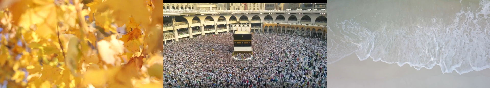
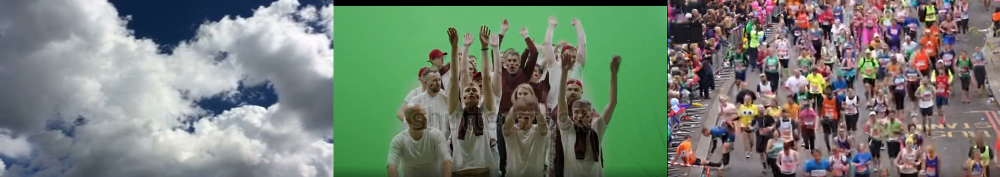

# Recognition of temporal textures using optical-flow

Temporal texture is a dense visual motion characterized by spatial and temporal uniformity --- meaning a video of an object(s) moving uniformly as time passes.
Images representing temporal textures that were used in this project can be found below.
There are three videos for each texture with the number of frames in each video noted in the results.
In this project, we represent each texture as a sequence of features, such as motion magnitude, direction, divergence, curl, and density.
We feed the nearest centroid classifier data of 70% of randomly selected frames and let it classify the remaining 30% of frames.
Results vary depending on the textures picked.
The best classification is given for the following textures: *mecca*, *marathon* and *wave*.

wind: leaves on the wind, mecca: pilgrims circle Kaaba, waves: ocean waves

clouds: clouds, wave: Mexican wave, marathon: marathon


|texture   |percentage |correct |wrong|
|----      |-----      |---     |-|
|mecca     |98.4%      |127     |2|
|marathon  |100.0%     |108     |0|
|wave      |84.8%      | 28     |5|

# Key features

The question is, how can a machine recognize which temporal texture it is viewing.
Before doing that we must observe what differentiates textures we must classify.
In the ocean wave video feature vectors are pointing either straight down after an incoming wave and then pulling back up to the ocean (key feature: **direction**).
Whereas in the pilgrims circling Kaaba video we have a circular motion (key feature: **curl**).
The leaves on the wind are characterized by an entropic motion (key feature: **divergence**), Mexican wave by rapid movements (key feature: **magnitude**), clouds by consistency (key features: **magnitude and divergence**), and lastly, marathon by sparseness (key feature: **magnitude**).
Every texture is represented by an array of 128x128 matrices of vectors.
Each matrix is formed as a difference of two neighbouring frames.
Each vector represents the movement of a particular feature that was moved between two frames.
And for getting the curl and divergence we need one more matrix to represent the difference between movements of features.

# Results

```
python analyze.py
```

|file           |number of frames|
|----           |--|
|mecca/1.mkv    |12|
|mecca/2.mkv    |34|
|mecca/3.mkv    |95|
|marathon/1.mkv |61|
|marathon/2.mkv |59|
|marathon/3.mkv |49|
|wave/1.mkv     |10|
|wave/2.mkv     |14|
|wave/3.mkv     |19|

|texture   |percentage |correct |wrong|
|----      |-----      |---     |-|
|mecca     |98.4%      |127     |2|
|marathon  |100.0%     |108     |0|
|wave      |84.8%      | 28     |5|
